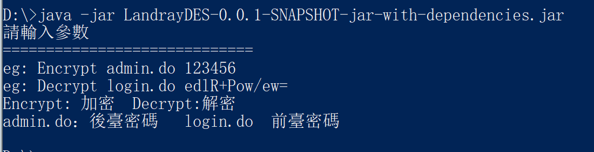

蓝凌OA 前后台加解密工具

* 后台密码

访问`/admin.do` 时该密码硬编码在`\WEB-INF\KmssConfig\admin.properties ` 文件中

* 前台密码

在`/login.jsp`登陆时使用的密码,数据库中分别存放`md5`和`DES`两种密文


* 使用方法



* 环境配置

>修改以下两个文件
>
>```
>%JDK_Home%\jre\lib\security\java.security
>%JRE_Home%\jre\lib\security\java.security
>```
>
>追加 最后一行
>
>```
>security.provider.1=sun.security.provider.Sun
>security.provider.2=sun.security.rsa.SunRsaSign
>security.provider.3=sun.security.ec.SunEC
>security.provider.4=com.sun.net.ssl.internal.ssl.Provider
>security.provider.5=com.sun.crypto.provider.SunJCE
>security.provider.6=sun.security.jgss.SunProvider
>security.provider.7=com.sun.security.sasl.Provider
>security.provider.8=org.jcp.xml.dsig.internal.dom.XMLDSigRI
>security.provider.9=sun.security.smartcardio.SunPCSC
>security.provider.10=sun.security.mscapi.SunMSCAPI
>security.provider.11=org.bouncycastle.jce.provider.BouncyCastleProvider
>```
>
>将bcprov-ext-jdk16-143.jar 放到
>
>     %JDK_Home%\jre\lib\ext
>     %JRE_Home%\jre\lib\ext


